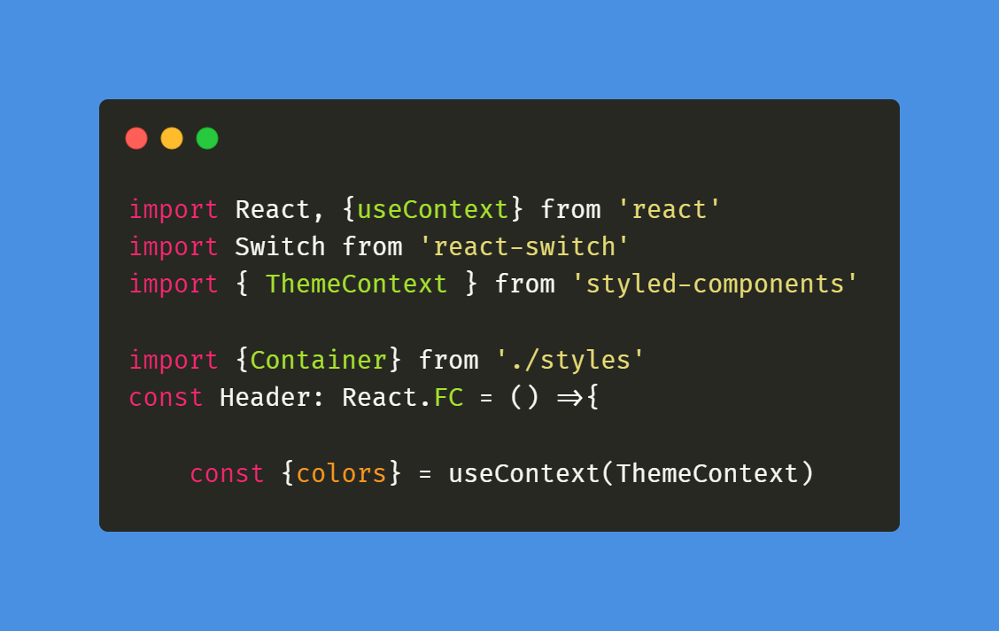

# Dependencies

## Styled-componets:
 - Library to use CSS-in-JS
 - npm install styled-components

## React-switch
 - Library to create a switch component
 - npm install react-switch

 ## @types/styled-components
 - Styled components definitions for typescript
 - npm install @types/styled-components -D
## Polished
 - Library to deal with colors
 - npm install polished

 # Learned
 ## informando propriedades do tema para o typescript:
 - Criar um arquivo de definição de tipos (styled.d.ts) e informar os tipos de cada campo
 
 - Para fazer com que esse arquivo seja compilado junto com a aplicação o seguinte será incluido no tsconfig.json:
 

## Acessando temas do styled-components fora do arquivo de estilização usando useContext:
 - importar ThemeContext do styled-components
 - Importar useContext do React
